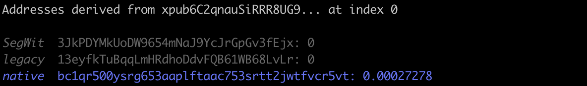

# Get balances from Xpub


Get the balances of Bitcoin addresses derivated from an xpub at a specific index (supported: legacy, native SegWit, and SegWit)

The balances are displayed in Bitcoin.

## Prerequisite

`$ npm i`

## Configure (optional)

In `main.js`, set the `xpub` and `index` variables.

## Run

If xpub and index are hardcoded:
`$ node main.js`

To override the hardcoded xpub and index:
`$ node main.js <xpub> <index>`

(Example: `$ node main.js xpub6C...44dXs7p 0`)

## Output

All derived addresses are displayed with the corresponding balance in bitcoins. If an address has a non-zero balance, it is displayed in blue. If it has a zero balance, in grey. If the balance is erroneous (not a number) or if the request fails, it is displayed in red.

```
_{address type}_ {address}: {balance in bitcoin} [or {error message}]
```

## Example

