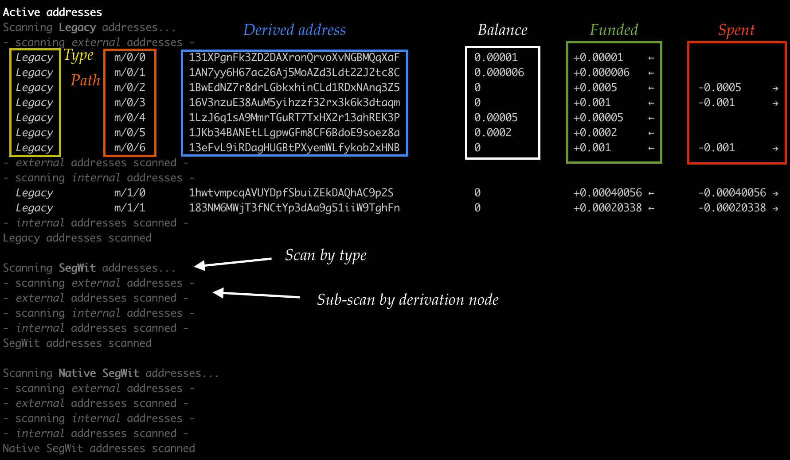
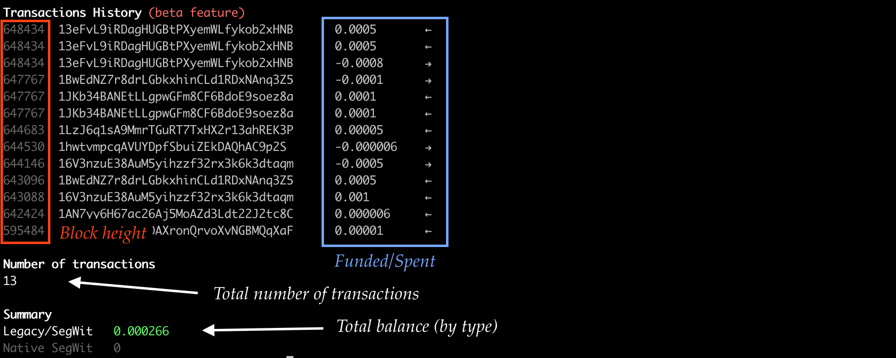

# Get balances from Xpub


From an xpub, get the balances of Bitcoin legacy, native SegWit, and SegWit accounts.

## Features

* Privacy Friendly: xpubs are not sent over the Internet: only their derived addresses are 
* Derives specific addresses (by account+index) or all active ones
* Supports legacy, SegWit, and Native Segwit
* Search if a given address has been derived from an xpub

## Install

`$ npm i`

## Main usage: check balances

### Scan for a specific account and an index

`$ node scan.js <xpub> <account> <index>`

Example: 
`$ node scan.js xpub6C...44dXs7p 0 10` [addresses at account `0`, index `10`]

### Scan all active addresses

_This is a slow process: please be patient_

`$ node scan.js <xpub>`

Example: 
`$ node scan.js xpub6C...44dXs7p`

## Additional usage: check address against xpub

(Check if an address has been derived from an xpub)

`$ node scan.js <xpub> <address>`

## Docker

Build
`$ docker build -t xpubscan .`

Run
`$ docker run xpubscan <xpub> [optional: <args>]`

## Output

All relevant derived addresses are displayed with the corresponding balance _in bitcoins_. 

## Operation mode

The tool derives addresses from the xpub (by scanning by accounts and indices) and displays, if appropriate, each derived address with its correspond type (legacy, SegWit, or native Segwit), its current balance, as well as its funded and spent transactions (amount and count).

## Interface

When an analysis is performed, 3 elements are displayed in the following order:
* The analysis of each derived active address _(slow)_
* The ordered transactions _(instantaneous)_
* A summary: total number of transactions and total balance by address type _(instantaneous)_

### Addresses analysis part



### Transactions and summary parts



## Example 1: specific account and index

Scan addresses derived from account `1` and index `46`:

```
$ node main.js xpub6CMDks...9N1gz1ZT 1 46
  Legacy          m/1/46      1HCojkXWkZdKhUqaZUo42TFZJ2F51QgtXe            0.00009834      +0.00009834 ←
  SegWit          m/1/46      3B4FPjNYUEs6Tq2qzky5b73duMu1np5vS6            0               +0          ←
  Native SegWit   m/1/46      bc1qkx7e5t3vzyvnlj6euwqagds8zq53wqjx0gcn03    0               +0          ←

Summary
Legacy          0.00009834
SegWit          0
Native SegWit   0
```

## Example 2: full scan


