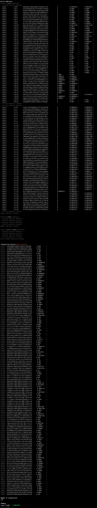

# Get balances from Xpub


From an xpub, get the balances of Bitcoin legacy, native SegWit, and SegWit accounts (by account+index or by active status).

## Install

`$ npm i`

## Usage

### Scan for a specific account and an index

`$ node scan.js <xpub> <account> <index>`

(Example: `$ node scan.js xpub6C...44dXs7p 0 10` [addresses at account `0`, index `10`])

### Scan all active addresses

`$ node scan.js <xpub>`

(Example: `$ node scan.js xpub6C...44dXs7p`)

## Output

All relevant derived addresses are displayed with the corresponding balance _in bitcoins_. 

## Operation mode

The tool derives addresses from the xpub (by scanning by accounts and indices) and displays, if appropriate, each derived address with its correspond type (legacy, SegWit, or native Segwit), its current balance, as well as its funded and spent transactions (amount and count).

## Example 1: specific account and index

Scan addresses derived from account `1` and index `46`:

```
$ node main.js xpub6CMDks...9N1gz1ZT 1 46
  Legacy          m/1/46      1HCojkXWkZdKhUqaZUo42TFZJ2F51QgtXe            0.00009834      +0.00009834 ←
  SegWit          m/1/46      3B4FPjNYUEs6Tq2qzky5b73duMu1np5vS6            0               +0          ←
  Native SegWit   m/1/46      bc1qkx7e5t3vzyvnlj6euwqagds8zq53wqjx0gcn03    0               +0          ←

Summary
Legacy          0.00009834
SegWit          0
Native SegWit   0
```

## Example 2: full scan


